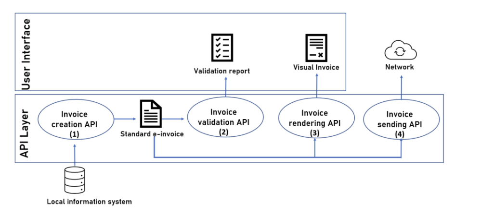
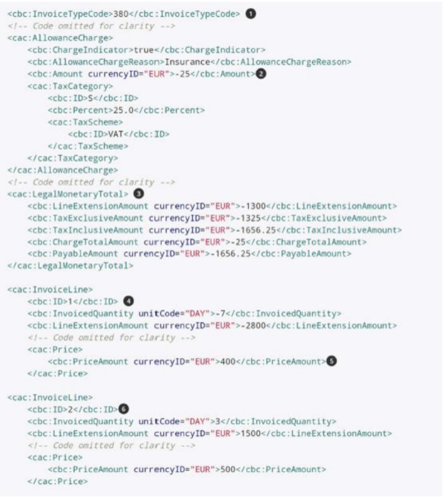
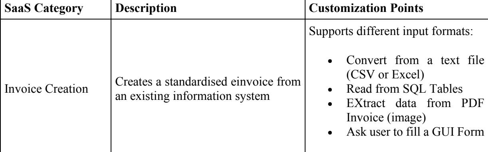
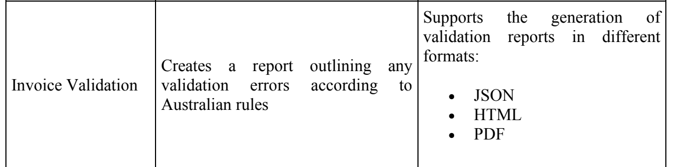
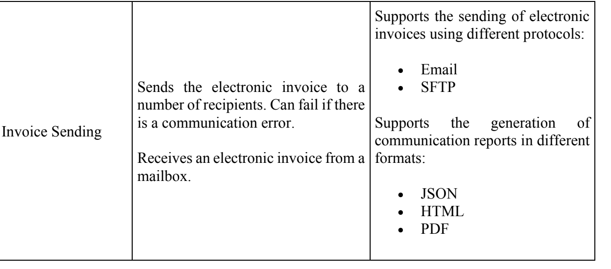

### NOTES (SUMMARY) FROM THE CLIENT DOC (Project: Business Process for SMEs utilizing E-invoicing APIs)

UBL - (Universal Business Language) UBL is a standard for XML business documents that supports the digitization of commercial and logistical processes in supply chains. It covers functions like procurement, purchasing, transport, logistics, and freight management.
a) Core elements of an e-invoice are part of the EN16931 semantic data model, which is a European Standard ensuring legal compliance.
b) The syntax of the UBL document must adhere to the UBL schema.
c) Each country can customize the standard according to its specific requirements.

1. The application is for a business (vendor) that buys and sells products or services as part of a supply chain. A supply chain includes all the steps to get a product from the manufacturer to the customer.
2. Need to integrate the authentication mechanisms provided by the APIs to ensure secure transmission of data. This means ensuring that only authorized users can access and use the APIs.
3. Our Client required us to create three kinds of API structures
   a. Create E-Invoices: An API that can make electronic invoices. (MORE DATA ON THIS IN THE END SEPARATE SECTION CREATED)
   b. Validate E-Invoices: API should check if the invoices are correct and valid. (MORE DATA ON THIS IN THE END SEPARATE SECTION CREATED)
   c. Send E-Invoices: API should send these invoices to the right places. (MORE DATA ON THIS IN THE END SEPARATE SECTION CREATED)
   d. Except for this we will need to create extra api's and features in the app as Arthur stated else max marks for project can only be 65-70%
4. 
5. Why is E-invoicing Important - Manufacturers for example airbus building an airplane outsources several parts of the airplane (like engines come from rolls royce) hence creating a network of collaborations. In context, e-invoicing is crucial for Airbus as it helps them exchange business documents, like invoices, with their partners more efficiently. For example, when Airbus buys parts from a supplier, e-invoicing ensures the payment process is automated and accurate. But in doing this airbus must comply with certain industry standards so that all the involved parties can understand the documentations (invoices). For instance, in Australia, there are regulations that require structured electronic invoices for public procurement.
   NOTE: Industry 4.0 basically refers to 4th industrial revolution which involves taking all these kind of procedures to the online world.
6. In 2014 Europe recognized UBL as the industry standard for e-invoicing. In Australia, New South Wales state GOVERNMENT AGENCIES are required to use e-invoicing for goods and services valued at up to AUD 1 million since 2022. This requirement is now being planned to be applied to SME's as well (Small and Medium-sized Enterprises). But unfortunately they are quite unwanting to adopt this requirement as it will require them to spend on a team that can create these documents according to industry standards. Hence this project is required to provide them with a cost-effective and flexible solution that allows them to use components from different vendors and maintain control over their e-invoicing solutions' evolution.
7. We need to dev a SaaS e-invoicing ecosystem. Meaning creating a software product accessible via a REST API, hosting it on a cloud server (in out case just docker is fine), allowing customers to subscribe and provide feedback, and providing automatic updates to subscribed customers.
8. Example UBL XML file for reference - 
   REFERENCE TABLE TO UNDERSTAND THE IMAGE

   1. Invoice type code 380 indicates it is an invoice
   2. The charge amount is negative to correct the original invoice
   3. All document-level (LegalMonetaryTotal) amounts are negative
   4. Start of invoice line 1
   5. The price amount must always be positive and is not changed
   6. Start of invoice line 2

9. There are slight variations between the different UBL invoices according to countries. In this
   context, we use Australia’s UBL specifications available at:
   https://softwaredevelopers.ato.gov.au/sites/default/files/resource-attachments/A_NZ_Invoice_specification_tracked_v1.0.docx
   https://github.com/A-NZ-PEPPOL/A-NZ-PEPPOL-BIS-3.0
10. Remember Auth is very important in this project and NEED CLARIFICATION as to whether api's related to documentation are only accessible after some kind of subscription
11. UBL REQUIREMENT FOR AUSTRALIA - https://github.com/A-NZ-PEPPOL/A-NZ-PEPPOL-BIS-3.0. ;;;;; SAMPLES CAN BE FOUND HERE: https://github.com/A-NZ-PEPPOL/A-NZ-PEPPOL-BIS-3.0/tree/master/Message%20examples

### INVOICE CREATION:

1. An API that can make electronic invoices. - https://upbrainsai.com/ - this provides api to turn PDF to JSON which will then need to be converted to UBL XML by us. - 
2. INPUT Sources: The service should be able to process pre-formatted data from various sources, including:
   1. Text files (CSV or Excel) containing invoice data.
   2. Database tables (SQL) containing invoice data. - Use can also upload data in a table format
   3. Images (PDF) from which invoice data can be extracted. - USING THE upbrainsai API
   4. GUI form where users can input invoice data manually.
3. OUTPUT: output should conform to the UBL 2.1 XML format, allowing it to pass validators mentioned in the "Invoice Validation" section. Starting with minimised invoices is recommended due to the complexity of the standard.
4. IMP: Our app must tell the user what the required fields are to generate a basic UBL file, but note that it is stated that there shouldn't be too many limitations as this will result in the reduced usability and generality

### INVOICE VALIDATION:

1. API should check if the invoices are correct and valid. - Use ESS Validator for this - A guide to ESS Validator is in the given PDF ESS 
2. INPUT - User will give an UBL 2.1 XML File and that will need to be validated by us
3. OUTPUT
   a) MUST INCLUDE - JSON, PDF or HTML of what all rules were checked and whether they passed or failed
   b) If Any RULE FAILED - Indication of violated validation rules - MEANING something that shows user which rule was violated and where
   c) Optionally: Quick-fix methods to validate the rules.
4. API's that can be used for doing this include:
   • ESS Validator (for details contact Muhammad Raheel Raza
   muhammad_raheel.raza@unsw.edu.au). A guide to ESS Validator is in the given PDF ESS
   Validate API - Developer Guide 2- Google Docs.pdf
   • ECOSIO validator: https://ecosio.com/en/peppol-and-xml-document-validator/

### INVOICE SENDING

1. API should send these invoices to the right places. - Will need to create ourselves - Service to send invoices through email - very simple I can give the framework I have made it before if we work in NODE 
2. INPUT: A UBL file either uploaded by the user or selected from the one that was converted by them
3. OUTPUT:
   a) The service should send the invoice to the external environment.
   b) It should return a communication report, indicating the success or failure of the delivery.
   c) The report format that is displayed on successful or failed sent can be JSON, HTML, or PDF, and should include human-readable messages in case of communication errors. (REACT NOTIFICATION (ERROR GENERATOR CAN BE SIMPLY JSON))
4. Storecove API can be used for this https://www.storecove.com/au/en/ (if PEPPOL network is selected).
