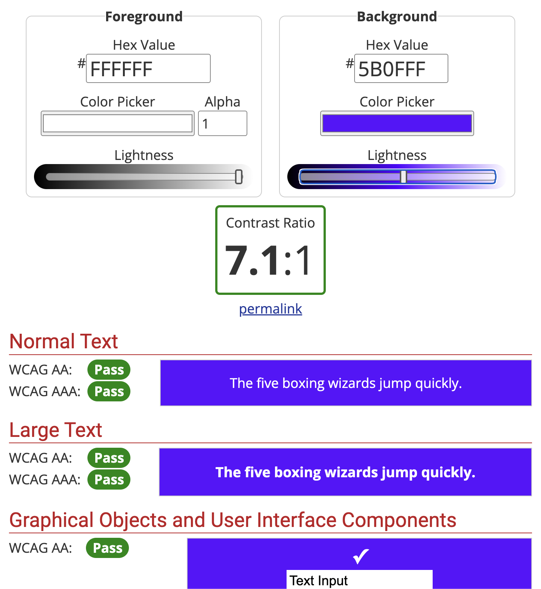

### How is the frontend interface accessible to specially abled:

1. Even on images the text used is actually in the html and hence can be read by the page readers
2. All images have sensible alt texts
3. Good Contrast used everywhere
   
